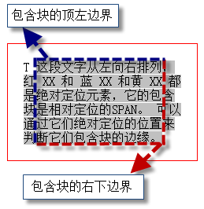

## Box module

元素形成了一个矩形的区域，这个区域就是 CSS 中最基本的布局要素， 常被称作 "box"

每个box都包含一个内容区域、内边距区域、边框区域、外边距区域。

### margin

**有些情况下，margin不起作用：**

* 对于行内非替换元素（例如 SPAN）垂直方向的margin不起作用

* table 类型中 的 TD TR TH 等margin是不起作用的。

注：替换元素是指 input 、 img等，元素中没有实际内容，浏览器根据元素的标签和属性来决定元素的具体显示内容，也就是说会把元素属性替换成相应的内容。

#### Collapsing margins

##### 什么时候会发生叠加

普通流中相邻的两个块元素在垂直方向上设置的margin会发生叠加。

##### 常见情况

* 父元素的margin-top和它的第一个子元素的margin-top,父元素的margin-bottom和它的最后一个子元素的margin-bottom。父元素没有加border和padding并且父子元素之间没有非空内容。

* 上一个元素的margin-bottom和下一个元素的margin-top。两个元素都在普通流中，没有float、absolute、inline-block

* 一个没有创建BFC、没有子元素高度为0的元素的margin-top和margin-bottom。

##### 如何避免

* 父子关系中可通过给父元素添加border或者padding

* 兄弟元素中可以通过浮动或者绝对定位其中一个元素

* 但是最好的避免方法是：只给其中一个元素添加垂直外边距

## 框布局

在可视化格式模型中，每一个元素都会根据框模型产生 0 个或多个框，而这些框的布局受某些因素的影响。

### 框的尺寸和类型

框的类型是指 display 特性所决定的元素类型，如：DIV 是块级元素，SPAN 是行内元素等。这个特性会使元素产生相应的控制框。

### 定位

框在布局时，根据三种定位体系定位。分别是，常规流、浮动和绝对定位。

### 外部信息

比如，可视窗口的大小会对布局有影响。有的页面要求自适应窗口大小，就是因为窗口大小对布局有影响。再比如，图片的固有尺寸，会影响行内替换元素的尺寸，进而影响这个布局。

## 三种定位体系

**display、position、float的相互关系**

 "position:absolute" 和 "position:fixed" 优先级最高，有它存在的时候，浮动不起作用，'display' 的值也需要调整；
 
元素的 'float' 特性的值不是 "none" 的时候或者它是根元素的时候，调整 'display' 的值； 

非根元素，并且非浮动元素，并且非绝对定位的元素，'display' 特性值同设置值。

### Normal flow

常规流包括块框( block boxes )的块格式化( block formatting )， 行内框( inline boxes )的行内格式化( inline formatting )，块框或行内框的相对定位，以及插入框的定位。

### Floats

它漂浮在常规流的上方。

在浮动模型中，一个框( box )首先根据常规流布局，再将它从流中取出并尽可能地向左或向右偏移。内容可以沿浮动区的侧面排列。 因为它首先要根据常规布局后才偏移，所以效率较常规流低。

浮动框就是一个框在当前行被向左或向右偏移，直到它的外边界接触到它包含块的边界或另一个浮动元素的外边界， 如果存在一个行框，浮动框的顶边会和当前行框的顶部对齐。

### Absolute positioning

一个框整个地从常规流中脱离（它对后续的兄弟元素没有影响），并根据它的包含块来分配其位置。

#### 相对定位

一个框按照常规流或者浮动得到定位，它还可以相对该位置偏移，这就是相对定位。

相对定位的框B不会对后面的框A有影响：后面的框就像B没有发生偏移一样

B偏移后，A不会重新定位

相对定位元素处于常规流中，相对于元素在常规流中的原位置进行定位，偏移后，在常规流中依然占据原位置，这也意味着相对定位可能产生框的重叠。

如果相对定位引起"overflow:auto"或"overflow:scroll"框的溢出，会创建需要的滚动条，这可能会影响布局。而且存在兼容性问题。

#### 绝对定位

绝对定位的框从常规流中脱离。

它们对其后的兄弟元素的定位没有影响。

绝对定位元素定位的参照物是其包含块，不一定是其父元素。

绝对定位框有外边距(margin)， 它们不会和其它任何外边距发生折叠（Collapsing margins）。

一般情况下绝对定位和固定定位的元素， 在 3D 的可视化模型中，处于浮动元素的上方，或者说比浮动元素更靠前。

常规流中的框，都在同一个层上，浮动框是处于常规流之上的一个特殊层，它可能会对常规流中的框的定位产生影响。但绝对定位的框不会， 每个绝对定位的框都可以看做一个单独的图层，不会对其他层框的定位产生影响。

一个绝对定位框会为它的常规流子元素和定位子元素(不包含 fiexed 定位的元素)生成一个新的包含块。 不过，绝对定位元素的内容不会在其它框的周围排列。

## Containing block

### 为什么要理解包含块

宽度高度自动值的计算、浮动元素定位、绝对定位元素的定位等都跟包含块有关。

### 怎么找一个元素的包含块

#### 静态或相对定位元素的包含块

position值为static或relative的元素，它的包含块由它最近的块级、单元格或者行内块祖先元素的**内容框**创建。

#### 绝对定位元素的包含块

绝对定位元素的包含块由离他最近的position属性为absolute、relative或者fixed的祖先元素创建。

如果其祖先元素是行内元素，则包含块取决于其祖先元素的"direction"属性

如果 'direction' 是 'ltr'，包含块的顶、左边是祖先元素生成的第一个框的顶、左内边距边界(padding edges) ，右、下边是祖先元素生成的最后一个框的右、下内边距边界(padding edges) 

行内元素内形成的包含块，在各浏览器中各不相同，存在兼容性问题。

**如果祖先元素不是行内元素，那么包含块的区域是祖先元素的内边距边界**

## 层叠

### z-index

* 属性值为整数时，表示生成框在当前层叠上下文中的层叠级别

* auto 表示生成框在当前层叠上下文中的层叠级别和她的父框相同，而且不生成新的局部层叠上下文。

### 层叠上下文
在文档中，每个元素属于一个层叠上下文

层叠上下文是一个抽象的容器，包含层和子元素创建的局部层叠上下文。

在层叠上下文内部，各层按照规则在Z轴方向上从后向前排列。

在给定的层叠上下文中，每个元素都有一个整型的层叠级别，它表示在相同层叠上下文中的元素在Z轴上的显示顺序。

### 层叠规则（从后向前）

1.形成层叠上下文的元素的背景和边框

2.层叠级别为负值的后代层叠上下文

3.常规流内非行内非定位的子元素组成的层

4.非定位的浮动子元素和它们的内容组成的层

5.常规流内行内非定位子元素组成的层

6.任何 z-index 是 auto 的定位子元素，以及 z-index 是 0 的层叠上下文组成的层

7.层叠级别为正值的后代层叠上下文

父元素-->z-index<0的子元素-->常规流中的非定位块级子元素--->浮动子元素--->常规流行内非定位子元素--->z-index=auto的子元素以及z-index=0的子元素--->z-index>0的子元素

## 样式表

### 用户端样式表 UA style

来自浏览器的样式，是浏览器的默认样式

### 用户样式表

使用浏览器的用户根据自己的喜好设置的样式表

### 作者样式表

开发网页时，所定义的样式表

根据 CSS 样式的来源和重要性(是否含 !important )，给出了优先级的升序排列：

1.用户端声明( UA declarations )

2.一般用户声明( user normal declarations )

3.一般作者声明( author normal declarations )

4.加了 '!important' 的作者声明( author important declarations )

5.加了 '!important' 的用户声明( user important declarations )

## Formatting context

格式化上下文指的是初始化元素定义的环境。

上下文定义了元素所处的环境，格式化表明元素处于此环境中应当被初始化。

### Block formatting context

在块格式化上下文中，框一个接一个的被垂直放置，他们的起点是一个包含块的顶部。

###触发方式

* 浮动元素

* 绝对定位元素

* 行内块元素

* 单元格
 
* 表格标题元素

* overflow非visible的元素

这些元素会创建新的块格式化上下文

### 特性

* 可以包含浮动元素

* 可以阻止外边距折叠

* 可以阻止元素被浮动元素覆盖

### Inline formatting context

行格式化上下文中，框一个接一个的水平排列，起点是包含块的顶部。

### 行框（line boxes）

通常，行框的左右边接触到其包含块的左右边，但是浮动元素可能处于包含块边缘和行框边缘之间。

同一行内格式化上下文中的行框通常高度不一样，如一行包含了高的图形。

#### 行内框在行框中的对齐

##### 垂直方向上的对齐

行内框在行框中垂直方向上的对齐取决于vertical-align特性，默认为baseline对齐

vertical-align = "top",行内框顶端与行中最高元素的顶外边界对齐。

##### 水平方向上的对齐

行内框宽度总和小于包含他们的行框的宽，他们在水平方向上的对齐，取决于text-align特性。

text-align="center",行内框在行框中居中对齐

行内框超出包含它的行框的宽度，它会被分割成几个框，并且这些框会被分布到几个行框内

